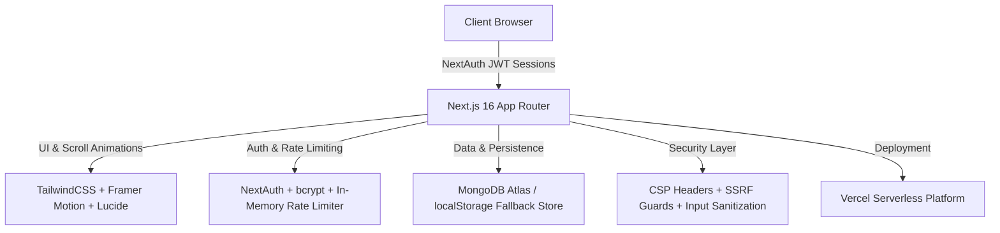

<div align="center">

  <br />
  
  

  <p align="center">
    <b>The Ultimate All-in-One Resource Platform Designed for Polytechnic &amp; Diploma Students</b>
  </p>

  <p align="center">
    <a href="https://dip-desk.vercel.app" target="_blank">
      
    </a>
    <a href="https://github.com/0-ZERONE-1/Dip-Desk">
      
    </a>
  </p>

  <p align="center">
    
    
    
    
  </p>

  <br />

</div>

---

## 📋 Overview

**Dip-Desk** is a high-performance, full-stack web application engineered specifically for **Polytechnic & Diploma Engineering students**. It provides structured, instant access to syllabus-aligned **Lecture Notes**, **Reference Textbooks**, **Model Question Papers**, and **Practical Lab Manuals** — grouped by branch, semester, and subject.

Designed with a focus on modern aesthetic excellence, dynamic scroll animations, and bulletproof security, Dip-Desk bridges the gap between students looking for study materials and administrators curating academic content.

---

## ✔️ Key Features

### 🎓 **Student Experience**
- **Instant Global Search**: Sub-second real-time search with dynamic dropdown suggestions across all departments, semesters, and subjects (powered by Fuse.js).
- **Instant Online Document Viewer**: Preview PDFs and study guides directly in-browser — no downloads, no storage required.
- **Scroll-Triggered Animations**: Hero stats, feature cards, and notice sections animate in only when scrolled into view — skip animations on SPA navigation.
- **Community Quality Voting**: Upvote or downvote study materials to surface the best resources.
- **Personal Student Panel** (direct-transfer via avatar click):
  - **Editable Profile**: Full Name, Title/Designation, Institute Name, Registration Number, Profile Photo.
  - **Saved Resources Library**: 1-click bookmark access for exam season.
  - **Liked / Disliked Resource Tracking**: Keep tabs on materials you rated.
  - **Resource Request Pipeline**: Submit requests for missing notes and track fulfillment (`Pending` / `Fulfilled`).

### 👑 **Admin Management Panel**
- **Direct Admin Access**: Clicking the account avatar circle routes directly to `/admin` — no dropdown menus.
- **Department & Subject Hierarchy**: Create, edit, and organize academic departments, semester curricula, and subject cards.
- **Resource Management**: Upload, edit, verify, or toggle resource availability — URL validated on input.
- **Notice Board Manager**: Broadcast pinned diploma announcements with live badge alerts.
- **Request Approval Pipeline**: Review and fulfill student study material requests.
- **User Management**: View all registered students, ban/unban accounts.
- **Developer Team Profiles**: Manage the Developers page team member cards.
- **Site-Wide Custom Branding**: Paste any public SVG or image URL to replace the header logo across the entire platform. Falls back to a simple book icon when no URL is set.
- **Link Health Check**: Run a server-side scan to detect broken external resource links in the database.

### 🔐 **Security**
- bcrypt password hashing (cost factor 12)
- Rate limiting on registration (5/IP/15min) and login (10/email/15min)
- NoSQL injection protection via `sanitizeString()` on all user inputs
- URL SSRF protection via `validateUrl()` with private IP blocklist (`10.x`, `192.168.x`, `169.254.x`, `::1`, etc.)
- Health-check SSRF guard — validates all stored URLs before server-side fetch
- Input sanitization on all admin resource creation inputs
- Content Security Policy (CSP), HSTS, X-Frame-Options, X-Content-Type-Options headers
- Admin role enforced server-side on every write endpoint (`requireAdmin()`)
- Middleware edge guards on `/admin/*` and `/dashboard/*`

---

## ⚙️ Software & Technologies Used

| Technology | Version | Purpose |
| :--- | :--- | :--- |
| ⚡ **Next.js** | **v16.3.0** | Full-stack React Framework (App Router & Turbopack) |
| 🔷 **TypeScript** | **v5.0.0** | Strongly-typed language for robust, safe code |
| 🎨 **Tailwind CSS / Vanilla CSS** | **v3.4.1** | Utility-first & custom HSL CSS engine for responsive UI |
| 🔐 **NextAuth.js** | **v4.24.7** | Authentication engine for Student & Admin session login |
| 🎭 **Framer Motion** | **v11.3.8** | Fluid layout animations & interactive micro-transitions |
| 🍃 **MongoDB / Mongoose** | **v8.5.1** | NoSQL cloud database with localStorage fallback |
| 🔍 **Fuse.js** | **v7.0.0** | Lightweight client-side fuzzy search indexing |
| 🎨 **Lucide React** | **v0.417.0** | Modern crisp SVG icons set for accessible UI elements |
| 🍞 **React Hot Toast** | **v2.4.1** | Dynamic alert toast notifications |

---

## 🔑 Access Credentials

| Role | Access URL | Email | Password |
| :--- | :--- | :--- | :--- |
| **Student** | `/login` → **Register / Sign In** | *Create any email & password* | *Min 8 characters* |
| **Admin** | `/login` → **Sign In** | Set via `ADMIN_EMAIL` env var | Set via `ADMIN_PASSWORD` env var |

> ⚠️ Admin credentials are loaded exclusively from environment variables. Never hardcoded.

---

## 🛠️ System Architecture



---

## 🚀 Getting Started

### 1. Prerequisites
- Node.js **18.x** or higher
- npm or yarn

### 2. Clone the Repository
```bash
git clone https://github.com/0-ZERONE-1/Dip-Desk.git
cd Dip-Desk
```

### 3. Install Dependencies
```bash
npm install
```

### 4. Configure Environment Variables
Create a `.env.local` file in the root directory:
```env
NEXTAUTH_URL=http://localhost:3000
NEXTAUTH_SECRET=your-strong-random-secret-here

# Optional: MongoDB Atlas connection
MONGODB_URI=mongodb+srv://<username>:<password>@cluster.mongodb.net/dipdesk

# Admin login credentials (required)
ADMIN_EMAIL=admin@yourdomain.com
ADMIN_PASSWORD=your-strong-admin-password
```

> 💡 Without `MONGODB_URI`, the app runs fully on an in-memory localStorage fallback store — great for demos.

### 5. Run Development Server
```bash
npm run dev
```
Open [http://localhost:3000](http://localhost:3000) in your browser.

---

## 📂 Project Structure

```
Dip-Desk/
├── app/                        # Next.js 16 App Router pages & API routes
│   ├── page.tsx                # Home page (hero, stats, features, notices)
│   ├── about/                  # About page (tech stack, features, user guide)
│   ├── browse/                 # Browse departments, semesters, subjects
│   ├── notice/                 # Live notice board
│   ├── developers/             # Developer team profiles
│   ├── admin/                  # Admin Panel (Dashboard, Notices, Resources, Users, Cheat, Health)
│   ├── dashboard/              # Student Panel (Profile, Saved, Liked, Requests)
│   ├── login/                  # Login & Registration page
│   └── api/                    # REST API endpoints
│       ├── auth/               # NextAuth & Registration
│       ├── resources/          # Resources CRUD
│       ├── notices/            # Notices CRUD
│       ├── departments/        # Departments CRUD
│       ├── subjects/           # Subjects CRUD
│       ├── developers/         # Developer profiles CRUD
│       ├── requests/           # Student resource requests
│       ├── stats/              # Platform stats & custom logo URL
│       ├── image-proxy/        # SSRF-guarded image proxy
│       ├── user/profile/       # Student profile GET & POST
│       └── admin/              # Admin-only: users, requests, health-check
├── components/                 # Reusable UI components
│   ├── admin/                  # AdminNav, AdminPageWrapper, ConfirmDeleteModal
│   ├── home/                   # Hero, FeaturesSection, LatestNoticeSection, StatsSection
│   └── layout/                 # Navbar, DipDeskLogo, MobileMenu, Search bar
├── lib/                        # Core backend utilities & models
│   ├── auth.ts                 # NextAuth authentication config
│   ├── store.ts                # Global in-memory store & persistence
│   ├── sanitize.ts             # Input sanitization & URL validation
│   ├── rateLimit.ts            # Per-IP & per-email rate limiter
│   ├── requireAdmin.ts         # Server-side admin session guard
│   ├── utils.ts                # Helpers including getRawImageUrl for GitHub URLs
│   └── models/                 # Mongoose schemas (User, Admin, Resource, Notice, etc.)
├── public/                     # Static assets & favicon
├── middleware.ts               # Edge middleware for route protection & ban enforcement
└── README.md                   # Project Documentation
```

---

## 👨‍💻 Author & Acknowledgements

Created with ❤️ by **ZERONE** for diploma students worldwide.

- **GitHub**: [@0-ZERONE-1](https://github.com/0-ZERONE-1)
- **Project Repository**: [Dip-Desk](https://github.com/0-ZERONE-1/Dip-Desk)
- **Live Web App**: [dip-desk.vercel.app](https://dip-desk.vercel.app)

---

<div align="center">
  <sub>Built for students, with students in mind. ⭐ Star this repo if you find it helpful!</sub>
</div>
