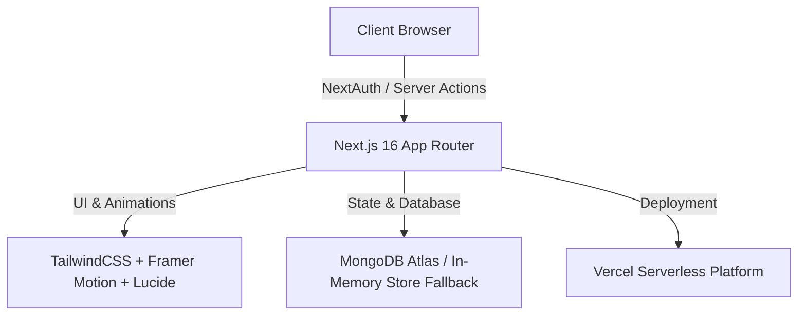

<div align="center">

  <br />
  
  

  <p align="center">
    <b>The Ultimate All-in-One Resource Platform Designed for Polytechnic & Diploma Students</b>
  </p>

  <p align="center">
    <a href="https://dip-desk.vercel.app" target="_blank">
      
    </a>
    <a href="https://github.com/0-ZERONE-1/Dip-Desk">
      
    </a>
    
    
    
  </p>

  <br />

</div>

---

## 🌟 Overview

**Dip-Desk** is a state-of-the-art, high-performance web application engineered specifically for **Polytechnic & Diploma Engineering students**. It provides structured, instant access to syllabus-aligned **Lecture Notes**, **Reference Textbooks**, **Model Question Papers**, and **Practical Lab Manuals** grouped by branch, semester, and subject.

Designed with a focus on modern aesthetic excellence, dynamic theme transitions, and seamless resource management, Dip-Desk bridges the gap between students looking for study materials and administrators curating academic content.

---

## ✨ Key Features

### 🎓 **Student Experience**
* **Instant Global Search**: Blazing-fast inline search with dynamic suggestions dropdown across all departments, semesters, and subjects.
* **Inline Document Viewer**: Built-in PDF previewer & instant external link access.
* **Interactive Rating System**: Upvote or downvote study materials to help fellow students find top-quality resources.
* **Personalized Student Panel**:
  * **Editable Profile**: Customize Full Name, Title/Designation, Institute Name, and Registration/Roll Number anytime.
  * **Saved Resources**: Quick access to bookmarked notes and question papers.
  * **Upvoted & Downvoted Records**: Track materials you find helpful.
  * **Resource Requests**: Submit requests for missing notes or books and track their fulfillment status (`Pending ⏳` / `Fulfilled ✓`).

### 👑 **Admin Management Panel**
* **Strict Credential Authentication**: Secure administrative dashboard powered by NextAuth.js.
* **Department & Subject Hierarchy**: Create, edit, and organize academic departments, semester curricula, and subjects.
* **Resource Management**: Upload, edit, verify, or toggle resource availability with one click.
* **Notice Board Manager**: Broadcast pinned diploma announcements and notifications with live badge alerts.
* **Request Approval Pipeline**: Review student resource requests and mark them as fulfilled.
* **Smooth Color Shifts**: Seamless transition between Student (Vibrant Blue) and Admin (Sleek Dark Purple) themes.

---

## 🔑 Demo Access Credentials

To test the application administrative capabilities, use the default administrator credentials below:

| Role | Access URL | Email | Password |
| :--- | :--- | :--- | :--- |
| **Administrator** | `/login` ➔ **Admin Sign In** | `admin@dipdesk.com` | `Admin.dipdesk` |
| **Student** | `/login` ➔ **Register / Sign In** | *Create any email & password* | *Any password* |

> [!NOTE]
> Students can register manually in seconds with just an email and password!

---

## 🛠️ Tech Stack & Architecture



* **Framework**: [Next.js 16 (App Router)](https://nextjs.org/)
* **Language**: [TypeScript](https://www.typescriptlang.org/)
* **Styling**: [TailwindCSS](https://tailwindcss.com/) + Custom CSS Glassmorphism
* **Animations**: [Framer Motion](https://www.framer.com/motion/)
* **Authentication**: [NextAuth.js](https://next-auth.js.org/) (JWT Strategy)
* **Database**: MongoDB Atlas (with automatic fallback to JSON In-Memory Store)
* **Icons**: [Lucide React](https://lucide.dev/)

---

## 🚀 Getting Started

Follow these steps to set up Dip-Desk locally on your machine:

### 1. Prerequisites
* Node.js **18.x** or higher
* npm or yarn

### 2. Clone the Repository
```bash
git clone https://github.com/0-ZERONE-1/Dip-Desk.git
cd Dip-Desk
```

### 3. Install Dependencies
```bash
npm install
```

### 4. Configure Environment Variables (Optional)
Create a `.env.local` file in the root directory:
```env
NEXTAUTH_URL=http://localhost:3000
NEXTAUTH_SECRET=dip-desk-super-secret-production-key-2026
MONGODB_URI=mongodb+srv://<username>:<password>@cluster.mongodb.net/dipdesk
```

### 5. Run Development Server
```bash
npm run dev
```
Open [http://localhost:3000](http://localhost:3000) in your browser to view the application!

---

## 📂 Project Structure

```
Dip-Desk/
├── app/                      # Next.js 16 App Router pages & API routes
│   ├── (public pages)        # Home, Browse, Notices, Developers, Login
│   ├── admin/                # Admin Panel views (Notices, Resources, Requests, Users)
│   ├── dashboard/            # Student Panel (Profile, Saved, Liked, Disliked, Requests)
│   └── api/                  # REST API endpoints (Auth, Resources, User, Admin)
├── components/               # Reusable UI components
│   ├── admin/                # Admin navigation & dashboard controls
│   ├── home/                 # Hero section, Features grid, Department cards
│   └── layout/               # Navbar, Mobile Menu, Footer, Search bar
├── lib/                      # Core backend utilities, Models & In-Memory Store
│   ├── auth.ts               # NextAuth authentication config
│   ├── store.ts              # Global In-Memory store & file system persistence
│   └── models/               # Mongoose schemas (User, Resource, Notice, etc.)
├── public/                   # Static assets & favicon
└── README.md                 # Project Documentation
```

---

## 👨‍💻 Author & Acknowledgements

Created with ❤️ by **ZERONE** for diploma students worldwide.

* **GitHub**: [@0-ZERONE-1](https://github.com/0-ZERONE-1)
* **Project Repository**: [Dip-Desk](https://github.com/0-ZERONE-1/Dip-Desk)
* **Live Web App**: [dip-desk.vercel.app](https://dip-desk.vercel.app)

---

<div align="center">
  <sub>Built for students, with students in mind. ⭐ Star this repo if you find it helpful!</sub>
</div>
